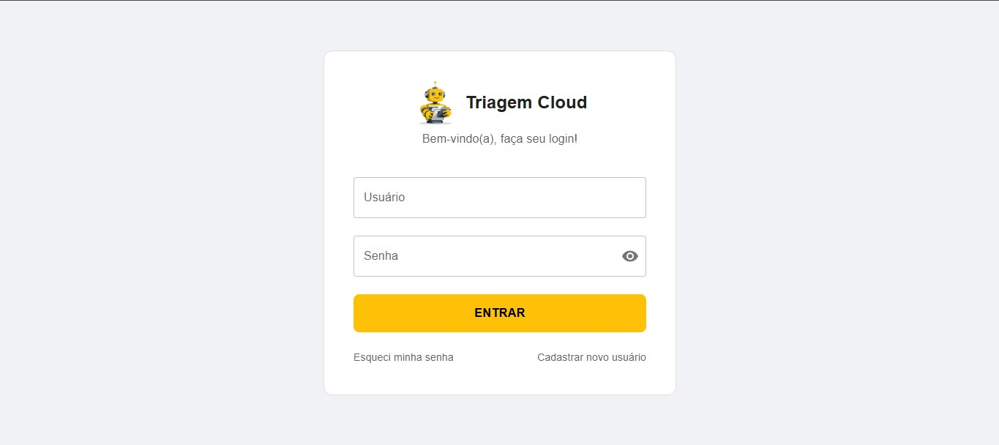
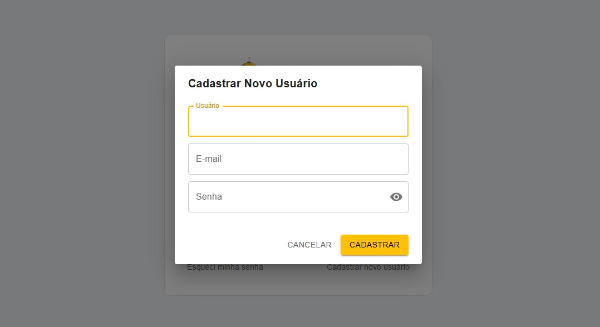
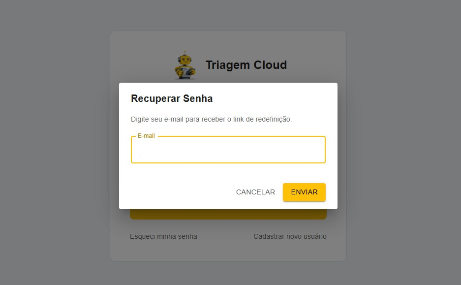
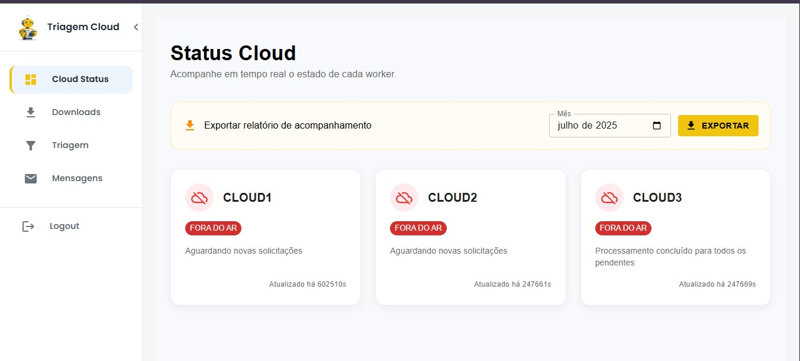
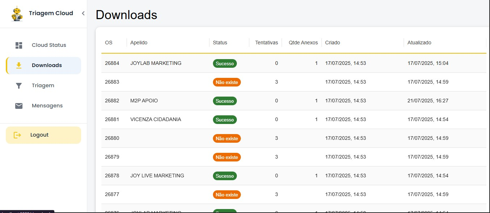
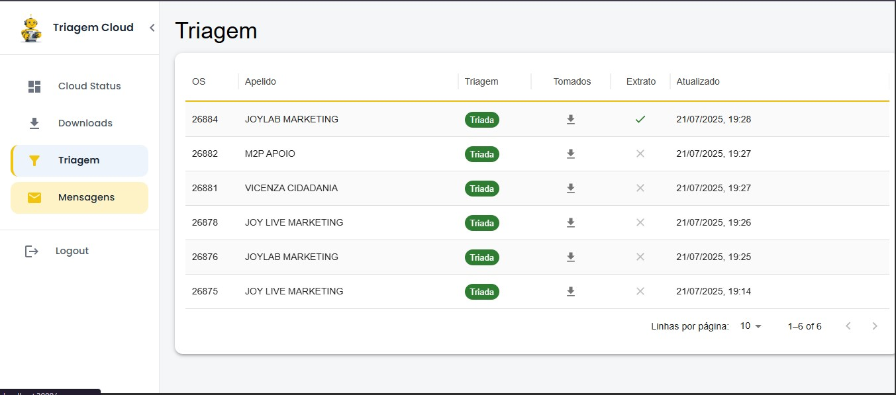
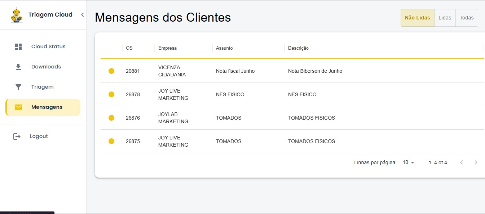

# Triagem Cloud – Plataforma Completa

Automação de downloads, triagem e processamento inteligente de documentos fiscais.  
Plataforma integrada composta por múltiplos serviços modulares (“Clouds”) + frontend web centralizado.

---

## 📦 Componentes

- **Cloud_1**:  
  Download automatizado de anexos de Ordens de Serviço (OS) do portal Onvio, organização em pastas, API de status, logs e heartbeat.  
  → [Leia o README de Cloud_1](./Cloud_1/README.md)

- **Cloud_2**:  
  Triagem automática dos downloads, extração de ZIP/RAR, classificação de PDFs com IA (Document AI), organização em estrutura de clientes, fila assíncrona, integração Pub/Sub.  
  → [Leia o README de Cloud_2](./Cloud_2/README.md)

- **Cloud_3**:  
  Processamento pós-triagem (“tomados”): recebe notificações do Cloud_2 via Pub/Sub, processa PDFs, gera arquivos finais, envia para Cloud Storage e atualiza status.  
  → [Leia o README de Cloud_3](./Cloud_3/README.md)

- **Cloud_front**:  
  Frontend em React (dashboard, login, redefinição de senha), backend central FastAPI (autenticação, APIs, integração com os outros clouds).  
  → [Leia o README do Cloud_front](./Cloud_front/README.md)

---

## 🗂 Estrutura do Repositório

```

Cloud\_complete/
├── Cloud\_1/
│   └── README.md
├── Cloud\_2/
│   └── README.md
├── Cloud\_3/
│   └── README.md
├── Cloud\_front/
│   ├── README.md
│   └── prints/
│       ├── login\_page.jpg
│       ├── modal\_newUser.jpg
│       ├── modal\_forgotPassword.jpg
│       ├── status\_page.jpg
│       ├── dowload\_page.jpg
│       ├── triagem\_page.jpg
│       └── messages\_page.jpg
└── scripts/

```

Cada pasta contém sua própria documentação, requisitos, instruções de instalação e execução.

---

## 🚀 Como começar

Cada componente pode ser utilizado de forma independente ou em conjunto, conforme seu fluxo de trabalho:

1. **Configuração inicial:**  
   - Siga os requisitos de cada módulo no seu respectivo README.
   - Instale dependências, crie arquivos `.env`, configure chaves, etc.

2. **Execução dos serviços:**  
   - Inicie o backend central (`Cloud_front/api.py`) e o frontend React.
   - Suba os workers/módulos de download, triagem e pós-processamento conforme demanda.

3. **Utilização:**  
   - Gerencie as OS, triagens e status pelo painel web.
   - Consulte logs, heartbeats e filas diretamente nos diretórios de cada módulo.

---

## 🖼️ Prints da Plataforma

### Login


### Cadastro de Novo Usuário


### Recuperar Senha


### Dashboard – Status Cloud


### Downloads


### Triagem


### Mensagens dos Clientes


---

## 🔗 Links úteis

- [Cloud_1: Download de anexos](./Cloud_1/README.md)
- [Cloud_2: Triagem automática](./Cloud_2/README.md)
- [Cloud_3: Tomados & processamento final](./Cloud_3/README.md)
- [Cloud_front: Frontend e backend central](./Cloud_front/README.md)

---

## 💬 Contato

Projeto desenvolvido por Renata Boppré Scharf.  
Dúvidas, sugestões ou bugs: **renata.boppre@gmail.com**

---

## 🛡️ Licença

MIT © Renata Boppré Scharf

---